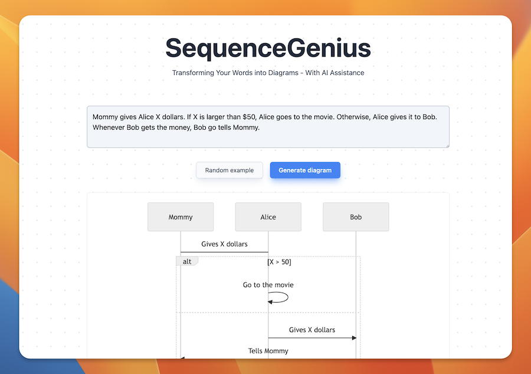

# SequenceGenius

Effortlessly generate sequence diagram from your ideas, with helps from AI.

Try it online at: https://seq.ascii-draw.com/

## How to use

Enter the idea you have in the text box, and hit Generate. If you have no idea in mind, hit the Random example button to see.

## Development

This is a NextJS application, calling OpenAI's Chat completion API, the model is `gpt-3.5-turbo`, and uses MermaidJS to render the
diagram.

More details on how to deploy locally will be added later, because it's Friday night.

Also, you need to have `OPENAI_API_KEY` environment variable configured if you want to run locally or deploy it on your own.
